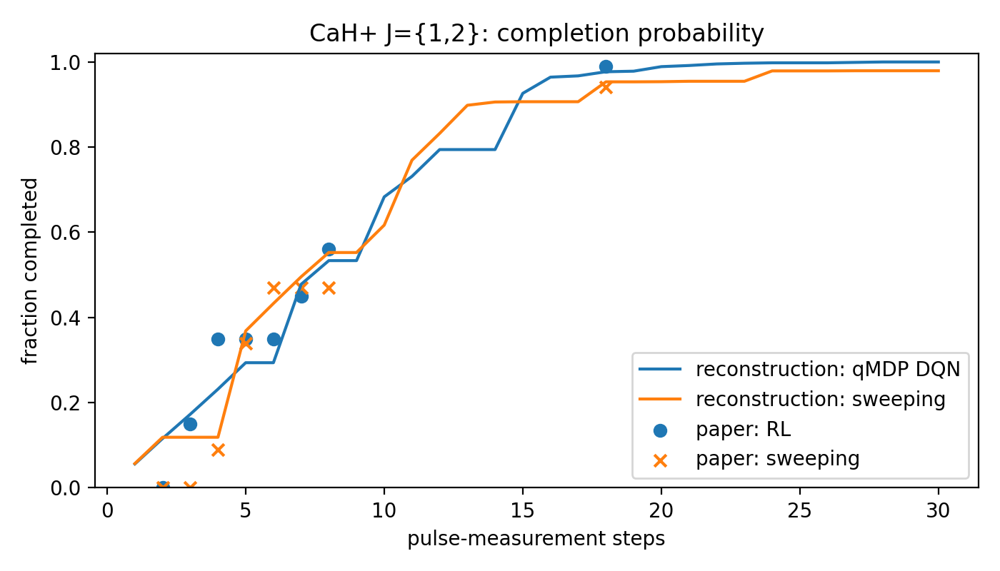
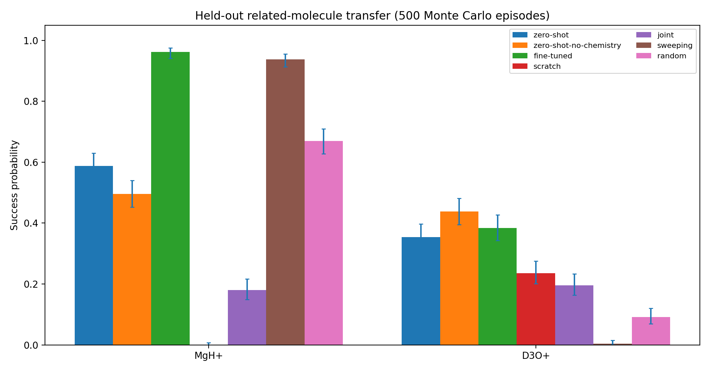
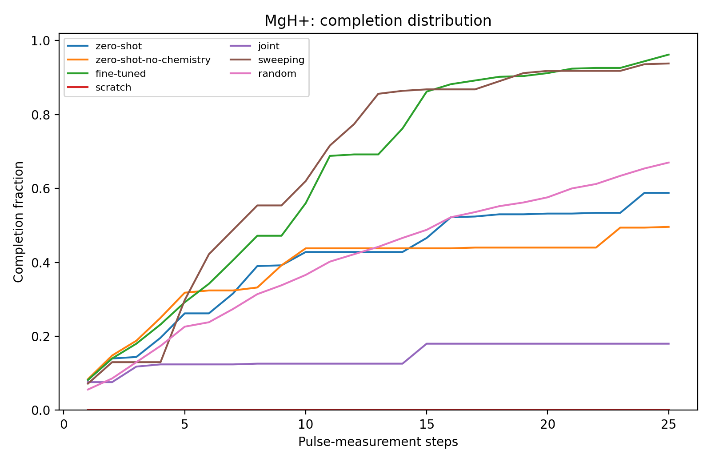
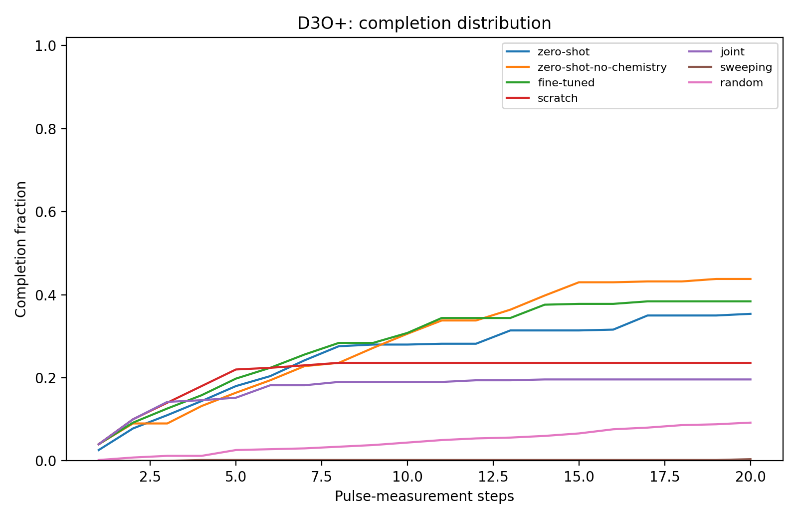
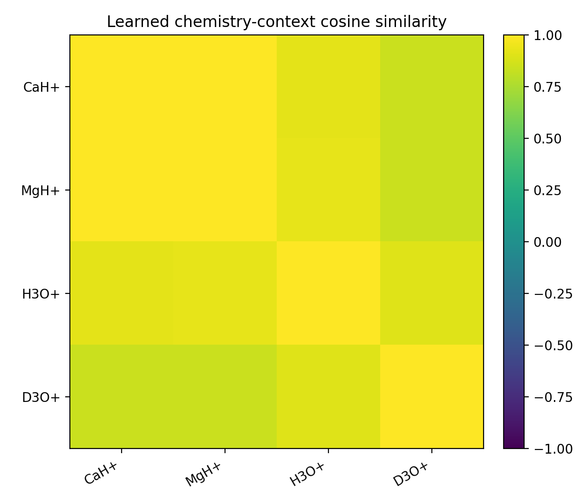

# Multi-Molecule GNN RL-QLS

This repository implements and extends the control framework of:

> A. Pipi, X. Tao, A. Wu, P. Narang, and D. R. Leibrandt,
> **Molecular Quantum Control Algorithm Design by Reinforcement Learning**,
> arXiv:2410.11839v5 / *Physical Review Research* **8**, 033103 (2026).

It contains two compatible layers:

1. the original single-molecule Gymnasium/Double-DQN/qMDP reconstruction for
   CaH+ or H3O+;
2. a new multi-task extension in which molecule-specific MDPs share one
   chemistry-conditioned, variable-action GNN Q-function.

The multi-task implementation uses one molecule per episode. It does not assume
that several molecular ions coherently share one motional mode in the same
experimental shot.

## Installation

```bash
python -m venv .venv
source .venv/bin/activate
python -m pip install -U pip
python -m pip install -e '.[test,physics]'
```

The core requirements include Gymnasium 1.3, NumPy, SciPy, PyTorch, and
Matplotlib. The optional `physics` extra installs QuTiP.

## Multi-molecule task family

For molecule $m$, the state and local action set are

$$
s^{(m)}\in\Delta_{N_m-1},
\qquad
\mathcal A_m=\{0,\ldots,A_m-1\}.
$$

The quantum transition model remains molecule specific:

$$
q_k^{(m)}=B_{a,k}^{(m)}s,
\qquad
p_m(k\mid s,a)=\mathbf 1^{\mathsf T}q_k^{(m)},
\qquad
s'_k=\frac{q_k^{(m)}}{p_m(k\mid s,a)}.
$$

One shared GNN scores each molecule's valid pulse candidates:

$$
Q_\Theta(o_m,a),
\qquad a\in\mathcal A_m.
$$

Padding provides fixed tensors for batching; an action mask ensures that the
agent never selects pulse slots outside the local library.

The default demonstration registry contains:

| task | states | actions | status |
|---|---:|---:|---|
| CaH+ | 16 | 13 | existing reconstruction, source |
| MgH+ | 16 | 13 | related-task transfer surrogate |
| H3O+ | 130 | 218 | existing reconstruction, source |
| D3O+ | 130 | 218 | related isotopologue transfer surrogate |

MgH+ and D3O+ validate the transfer software path. They are not
independently calculated molecular spectra.

## Main commands

Inspect the integrated environment:

```bash
PYTHONPATH=src python scripts/train_multitask.py --help
```

Train a shared controller:

```bash
PYTHONPATH=src python scripts/train_multitask.py \
  --tasks 'CaH+' 'H3O+' \
  --episodes 240 \
  --output results/source_controller
```

Run the complete pretrain/zero-shot/fine-tune/scratch workflow:

```bash
PYTHONPATH=src python scripts/run_transfer_study.py \
  --source-episodes 240 \
  --target-episodes 60 \
  --joint-episodes 160 \
  --eval-episodes 500
```

Independently evaluate a saved checkpoint:

```bash
PYTHONPATH=src python scripts/evaluate_transfer.py \
  --checkpoint results/source_controller/checkpoint.pt \
  --tasks 'MgH+' 'D3O+' \
  --episodes 500
```

Rebuild the supplied multi-policy transfer comparison from saved checkpoints:

```bash
PYTHONPATH=src python scripts/validate_transfer_suite.py \
  --output results/multimolecule_transfer_final \
  --episodes 500 \
  --reuse-existing
```

## Results

All numbers below come from the checked-in run in
[`results/multimolecule_transfer_final/`](results/multimolecule_transfer_final/):
500 independent Monte Carlo episodes per policy and task, from one training
seed. "Success" means the population reaches the 99% preparation threshold
before the step limit; censored means unsuccessful episodes are counted at that
limit. Rebuild everything with `scripts/validate_transfer_suite.py`.

### Source training on CaH+ and H3O+

240 round-robin episodes train one shared GNN on the two source molecules
(180 CaH+ episodes, 60 H3O+ episodes). The resulting controller reaches:

| source task | success rate | mean censored steps | completed by 8 steps |
|---|---:|---:|---:|
| CaH+ | 100.0% | 9.22 | 50.4% |
| H3O+ | 71.4% | 11.62 | 35.6% |

The source environment itself is worth checking separately. The figure below is
from the original single-molecule layer, not the shared GNN above: it compares
that reconstruction's CaH+ completion curve (lines) with the paper's reported
points (markers). The reasonable agreement is what makes CaH+ usable as a
source task in the first place.



### Zero-shot and fine-tuned transfer to MgH+ and D3O+

The pretrained controller is then evaluated on two molecules absent from
training. `zero-shot` applies the frozen checkpoint directly, `fine-tuned`
gives it 60 further episodes on the target, `scratch` trains a fresh network
under the same 60-episode budget, and `sweeping`/`random` are non-learned
baselines.



| target | zero-shot | fine-tuned | scratch | sweeping | random |
|---|---:|---:|---:|---:|---:|
| MgH+ | 58.8% | **96.2%** | 0.0% | 93.8% | 67.0% |
| D3O+ | **35.4%** | 38.4% | 23.6% | 0.4% | 9.2% |

The clearest result is MgH+: 60 target episodes lift the pretrained network
from 58.8% to 96.2%, while the same budget from scratch never completes a
single episode. At this budget the pretrained representation, not the extra
episodes, is what makes adaptation possible.

Two caveats sit in the same table. On MgH+, zero-shot (58.8%) is *below* the
random baseline (67.0%), and pulse sweeping alone already reaches 93.8%, so
only the fine-tuned policy is clearly ahead of doing something simpler. On
D3O+ the ordering reverses: every learned policy beats sweeping (0.4%) and
random (9.2%) by a wide margin, but fine-tuning adds little over zero-shot.

Completion distributions show the same story over the episode horizon:





Per-episode adaptation curves for the equal 60-episode budget are in
[`figures/MgHp_adaptation.png`](results/multimolecule_transfer_final/figures/MgHp_adaptation.png)
and [`figures/D3Op_adaptation.png`](results/multimolecule_transfer_final/figures/D3Op_adaptation.png).

### Learned chemistry representation

The chemistry encoder produces one context vector per molecule. Their cosine
similarities are:



The two metal hydrides are nearly identical (CaH+/MgH+, 0.998) and the
hydronium isotopologues are close (H3O+/D3O+, 0.901), which is the expected
grouping. The grouping is not clean, however: MgH+/H3O+ reaches 0.929, above
the within-hydronium value. With four tasks and one seed this is **not**
evidence that the learned chemistry representation improves generalization.
The ablation agrees: dropping chemistry conditioning hurts MgH+ zero-shot
(58.8% to 49.6%) but helps D3O+ (35.4% to 43.8%).

### How to read these numbers

MgH+ and D3O+ are controlled deformations of CaH+ and H3O+ built to exercise
the transfer machinery, not independently computed molecular spectra. These
results validate the architecture and learning workflow; they are not
quantitative predictions for MgH+ or D3O+ control. See
[`TRANSFER_RESULTS.md`](results/multimolecule_transfer_final/TRANSFER_RESULTS.md)
for the full table, Wilson intervals, and limitations.

## Architecture map

### Physics and Gym environment

- `src/rlqls/model.py`: molecule-specific branch maps $B_{a,k}$.
- `src/rlqls/multitask/task.py`: one molecular MDP plus transferable metadata.
- `src/rlqls/multitask/registry.py`: extensible molecule registry.
- `src/rlqls/multitask/env.py`: integrated Gymnasium environment and masks.
- `src/rlqls/multitask/builders.py`: CaH+/H3O+ sources and related targets.

### Graph observation and chemistry

- `src/rlqls/features/chemistry.py`: atom/isotope chemistry graphs.
- `src/rlqls/features/spectroscopy.py`: level and pulse-transition descriptors.
- `src/rlqls/multitask/observation.py`: padded masked graph observations.

### Shared GNN and learning

- `src/rlqls/gnn/chemistry_encoder.py`: atom/isotope message passing.
- `src/rlqls/gnn/spectroscopy_encoder.py`: chemistry-conditioned level GNN.
- `src/rlqls/gnn/pulse_scorer.py`: variable-cardinality pulse/hyperedge scorer.
- `src/rlqls/gnn/q_network.py`: shared $Q_\Theta(o_m,a)$.
- `src/rlqls/multitask/replay.py`: task-balanced replay.
- `src/rlqls/multitask/qmdp.py`: heterogeneous expected-branch target.
- `src/rlqls/multitask/trainer.py`: shared Double-DQN/qMDP training.

## Detailed documentation

- [`MULTI_MOLECULE_GNN_RLQLS_WALKTHROUGH.md`](MULTI_MOLECULE_GNN_RLQLS_WALKTHROUGH.md): detailed code and mathematical walkthrough.
- [`results/multimolecule_transfer_final/TRANSFER_RESULTS.md`](results/multimolecule_transfer_final/TRANSFER_RESULTS.md): supplied transfer experiment and limitations.
- [`RL_MDP_WORKFLOW_WALKTHROUGH.md`](RL_MDP_WORKFLOW_WALKTHROUGH.md): original single-molecule workflow.
- [`results/reproduction_report.md`](results/reproduction_report.md): original CaH+/H3O+ reconstruction assessment.

## Verification

```bash
PYTHONPATH=src pytest -q
```

The tests cover branch-map normalization, Gymnasium signatures, variable
state/action sizes, action masking, shared GNN forward passes, multi-task qMDP
training, and a terminal-reachability diagnostic for the related surrogates.

## Interpretation limits

The exact pulse-conditioned matrices used by the paper are not public. The
provided source environments therefore remain reconstructions. The new
multi-molecule transfer experiment validates the architecture and learning
workflow; it is not evidence for quantitative MgH+ or D3O+ control.
