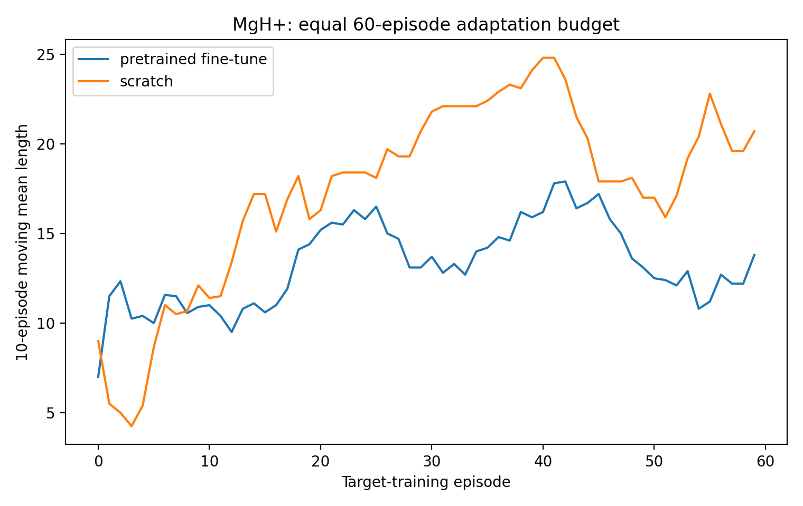
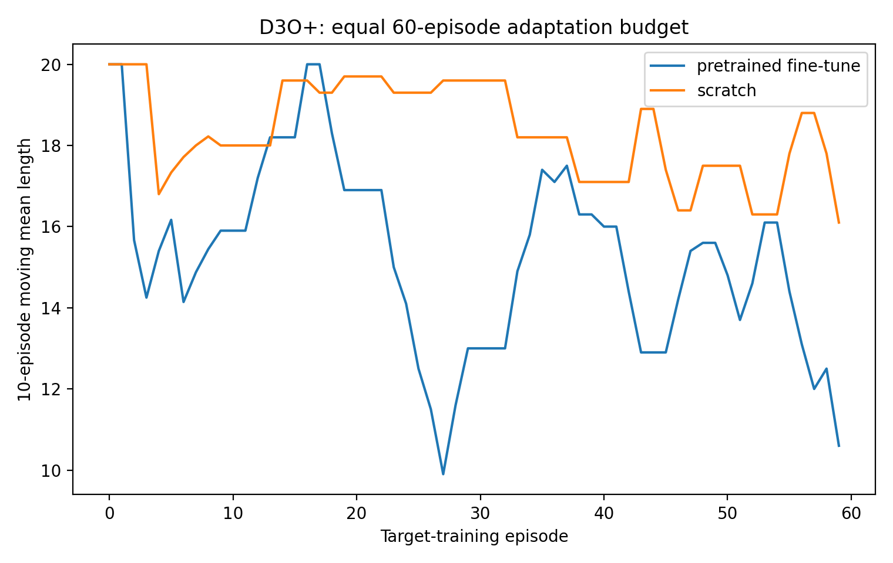

# Multi-Molecule GNN RL-QLS

This repository implements and extends the control framework of:

> A. Pipi, X. Tao, A. Wu, P. Narang, and D. R. Leibrandt,
> **Molecular Quantum Control Algorithm Design by Reinforcement Learning**,
> arXiv:2410.11839v5 / *Physical Review Research* **8**, 033103 (2026).

It contains two compatible layers:

1. the original single-molecule Gymnasium/Double-DQN/qMDP reconstruction for
   CaH+ or H3O+;
2. a new multi-task extension in which molecule-specific MDPs share one
   chemistry-conditioned, variable-action GNN Q-function.

The multi-task implementation uses one molecule per episode. It does not assume
that several molecular ions coherently share one motional mode in the same
experimental shot.

## Installation

```bash
python -m venv .venv
source .venv/bin/activate
python -m pip install -U pip
python -m pip install -e '.[test,physics]'
```

The core requirements include Gymnasium 1.3, NumPy, SciPy, PyTorch, and
Matplotlib. The optional `physics` extra installs QuTiP.

## Multi-molecule task family

For molecule $m$, the state and local action set are

$$
s^{(m)}\in\Delta_{N_m-1},
\qquad
\mathcal A_m=\{0,\ldots,A_m-1\}.
$$

The quantum transition model remains molecule specific:

$$
q_k^{(m)}=B_{a,k}^{(m)}s,
\qquad
p_m(k\mid s,a)=\mathbf 1^{\mathsf T}q_k^{(m)},
\qquad
s'_k=\frac{q_k^{(m)}}{p_m(k\mid s,a)}.
$$

One shared GNN scores each molecule's valid pulse candidates:

$$
Q_\Theta(o_m,a),
\qquad a\in\mathcal A_m.
$$

Padding provides fixed tensors for batching; an action mask ensures that the
agent never selects pulse slots outside the local library.

The default demonstration registry contains:

| task | states | actions | status |
|---|---:|---:|---|
| CaH+ | 16 | 13 | existing reconstruction, source |
| MgH+ | 16 | 13 | related-task transfer surrogate |
| H3O+ | 130 | 218 | existing reconstruction, source |
| D3O+ | 130 | 218 | related isotopologue transfer surrogate |

MgH+ and D3O+ validate the transfer software path. They are not
independently calculated molecular spectra.

## Main commands

Inspect the integrated environment:

```bash
PYTHONPATH=src python scripts/train_multitask.py --help
```

Train a shared controller:

```bash
PYTHONPATH=src python scripts/train_multitask.py \
  --tasks 'CaH+' 'H3O+' \
  --episodes 240 \
  --output results/source_controller
```

Run the complete pretrain/zero-shot/fine-tune/scratch workflow:

```bash
PYTHONPATH=src python scripts/run_transfer_study.py \
  --source-episodes 240 \
  --target-episodes 60 \
  --joint-episodes 160 \
  --eval-episodes 500
```

Independently evaluate a saved checkpoint:

```bash
PYTHONPATH=src python scripts/evaluate_transfer.py \
  --checkpoint results/source_controller/checkpoint.pt \
  --tasks 'MgH+' 'D3O+' \
  --episodes 500
```

Rebuild the supplied multi-policy transfer comparison from saved checkpoints:

```bash
PYTHONPATH=src python scripts/validate_transfer_suite.py \
  --output results/multimolecule_transfer_final \
  --episodes 500 \
  --reuse-existing
```

## Architecture map

### Physics and Gym environment

- `src/rlqls/model.py`: molecule-specific branch maps $B_{a,k}$.
- `src/rlqls/multitask/task.py`: one molecular MDP plus transferable metadata.
- `src/rlqls/multitask/registry.py`: extensible molecule registry.
- `src/rlqls/multitask/env.py`: integrated Gymnasium environment and masks.
- `src/rlqls/multitask/builders.py`: CaH+/H3O+ sources and related targets.

### Graph observation and chemistry

- `src/rlqls/features/chemistry.py`: atom/isotope chemistry graphs.
- `src/rlqls/features/spectroscopy.py`: level and pulse-transition descriptors.
- `src/rlqls/multitask/observation.py`: padded masked graph observations.

### Shared GNN and learning

- `src/rlqls/gnn/chemistry_encoder.py`: atom/isotope message passing.
- `src/rlqls/gnn/spectroscopy_encoder.py`: chemistry-conditioned level GNN.
- `src/rlqls/gnn/pulse_scorer.py`: variable-cardinality pulse/hyperedge scorer.
- `src/rlqls/gnn/q_network.py`: shared $Q_\Theta(o_m,a)$.
- `src/rlqls/multitask/replay.py`: task-balanced replay.
- `src/rlqls/multitask/qmdp.py`: heterogeneous expected-branch target.
- `src/rlqls/multitask/trainer.py`: shared Double-DQN/qMDP training.

## Multi-task training and transfer results

The supplied validation run pretrained one shared controller for 240 episodes on
CaH$^+$ and H$_3$O$^+$ using the schedule
`(CaH+, CaH+, CaH+, H3O+)`. It then evaluated direct transfer to held-out
related tasks and compared 60 target-training episodes of fine-tuning with the
same 60-episode budget from scratch. A separate joint reference used 160
episodes across all four tasks. Every policy/task entry below was evaluated
with 500 Monte Carlo episodes.

### Source-task check

| Source task | Success rate | Mean censored steps |
|---|---:|---:|
| CaH$^+$ | 100.0% | 9.22 |
| H$_3$O$^+$ | 71.4% | 11.62 |

These results show that one masked GNN policy can be trained across the very
different source dimensions (16 states/13 actions and 130 states/218 actions).
They are a multi-task implementation check rather than a comparison against
separately optimized specialist networks.

### Held-out related-task transfer

| Target | Policy | Success rate [95% CI] | Mean censored steps |
|---|---|---:|---:|
| MgH$^+$ | zero-shot | 58.8% [54.4, 63.0] | 15.38 |
| MgH$^+$ | zero-shot, no chemistry | 49.6% [45.2, 54.0] | 15.95 |
| MgH$^+$ | fine-tuned | 96.2% [94.1, 97.6] | 9.91 |
| MgH$^+$ | scratch | 0.0% [0.0, 0.8] | 25.00 |
| MgH$^+$ | joint | 18.0% [14.9, 21.6] | 21.55 |
| MgH$^+$ | sweeping | 93.8% [91.3, 95.6] | 9.38 |
| MgH$^+$ | random | 67.0% [62.8, 71.0] | 15.33 |
| D$_3$O$^+$ | zero-shot | 35.4% [31.3, 39.7] | 15.31 |
| D$_3$O$^+$ | zero-shot, no chemistry | 43.8% [39.5, 48.2] | 14.65 |
| D$_3$O$^+$ | fine-tuned | 38.4% [34.2, 42.7] | 14.71 |
| D$_3$O$^+$ | scratch | 23.6% [20.1, 27.5] | 16.03 |
| D$_3$O$^+$ | joint | 19.6% [16.4, 23.3] | 16.73 |
| D$_3$O$^+$ | sweeping | 0.4% [0.1, 1.4] | 19.97 |
| D$_3$O$^+$ | random | 9.2% [7.0, 12.1] | 19.15 |


The clearest result is MgH$^+$ adaptation: source initialization followed by
60 target episodes reaches 96.2% success, while the equal-budget scratch run
does not complete an episode. D$_3$O$^+$ transfer is positive but smaller:
fine-tuning reaches 38.4%, compared with 23.6% from scratch. Lower moving mean
episode length is better in the adaptation curves below.

<p align="center">
  
  
</p>

The zero-shot comparison is not uniformly favorable: it is stronger than
random and sweeping for D$_3$O$^+$, but weaker than both baselines for MgH$^+$.
The chemistry ablation is also mixed, improving MgH$^+$ zero-shot success by
9.2 percentage points but reducing D$_3$O$^+$ success by 8.4 points. Thus the
experiment supports reusable initialization and efficient fine-tuning, but it
does not yet establish a general chemistry-representation benefit. The weak
joint-policy result is consistent with task interference or an insufficient
equal-per-task update budget.

These comparisons use one training seed. The intervals describe rollout
uncertainty only, not training-seed variance. Moreover, MgH$^+$ and D$_3$O$^+$
are controlled deformations of the source branch maps with constructed action
correspondences, and the pulse descriptors include branch-map summaries. See
the [full transfer report](results/multimolecule_transfer_final/TRANSFER_RESULTS.md)
for the complete protocol, completion curves, and limitations.

## Walkthrough and results

- [`MULTI_MOLECULE_GNN_RLQLS_WALKTHROUGH.md`](MULTI_MOLECULE_GNN_RLQLS_WALKTHROUGH.md): detailed code and mathematical walkthrough.
- [`results/multimolecule_transfer_final/TRANSFER_RESULTS.md`](results/multimolecule_transfer_final/TRANSFER_RESULTS.md): supplied transfer experiment and limitations.
- [`RL_MDP_WORKFLOW_WALKTHROUGH.md`](RL_MDP_WORKFLOW_WALKTHROUGH.md): original single-molecule workflow.
- [`results/reproduction_report.md`](results/reproduction_report.md): original CaH+/H3O+ reconstruction assessment.

## Verification

```bash
PYTHONPATH=src pytest -q
```

The tests cover branch-map normalization, Gymnasium signatures, variable
state/action sizes, action masking, shared GNN forward passes, multi-task qMDP
training, and a terminal-reachability diagnostic for the related surrogates.

## Interpretation limits

The exact pulse-conditioned matrices used by the paper are not public. The
provided source environments therefore remain reconstructions. The new
multi-molecule transfer experiment validates the architecture and learning
workflow; it is not evidence for quantitative MgH+ or D3O+ control.
