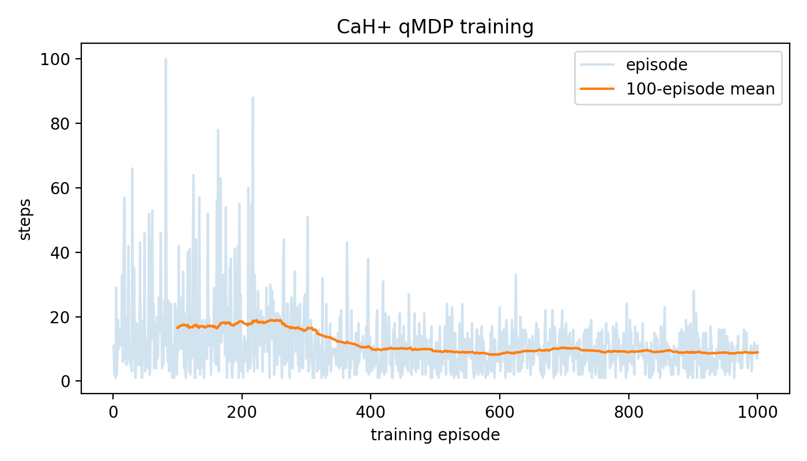
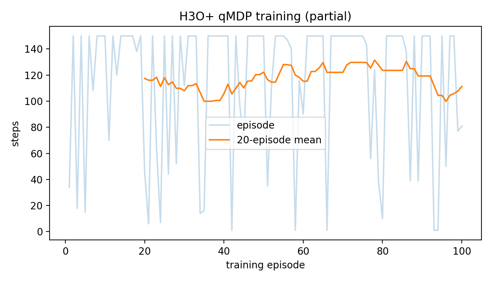
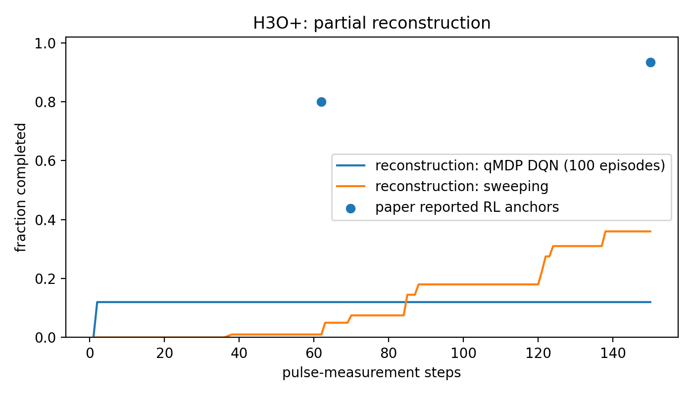

# RL-QLS: reinforcement learning for molecular quantum control

Implementation of A. Pipi *et al.*, **Molecular Quantum Control Algorithm Design by Reinforcement Learning**, arXiv:2410.11839v5 / *Physical Review Research* **8**, 033103 (2026).

The repository separates:

- the control layer: population-state Gymnasium environment, sampled Double DQN, and expected-branch quantum-MDP (qMDP) Double DQN;
- the physics layer: reconstructed CaH+ and H3O+ pulse maps. These are approximate because the paper does not publish its full Hamiltonians or pulse-conditioned matrices.

## Physics model

### Molecular state

After each measurement/cooling cycle, coherences are discarded and the molecular state is represented by populations

$$
s=(s_1,\ldots,s_{N_S})^T\in\Delta_{N_S-1},
\qquad s_i\geq0,
\qquad \mathbf 1^Ts=1.
$$

The default initial state is thermal:

$$
s_{0,i}=\frac{e^{-E_i/(k_BT)}}{Z},
\qquad
Z=\sum_j e^{-E_j/(k_BT)}.
$$

### Pulse and projective measurement

Action $a\in\{0,\ldots,N_A-1\}$ selects a Raman-sideband pulse. Its joint molecule-motion propagator is

$$
U_a=\mathcal T\exp\!\left[-\frac{i}{\hbar}\int_0^{\tau_a}H_a(t)\,dt\right].
$$

The motional measurement is binary: $k=0$ for $n=0$ and $k=1$ for $n\geq1$. Precomputed branch matrices are

$$
(B_{a,k})_{ji}
=\sum_{n\in\mathcal N_k}
\left|\langle j,n|U_a|i,0\rangle\right|^2,
\qquad
\sum_{k,j}(B_{a,k})_{ji}=1.
$$

For population $s$:

$$
\widetilde s_{a,k}=B_{a,k}s,
\qquad
p_k(s,a)=\mathbf 1^T\widetilde s_{a,k},
\qquad
s_{a,k}^{\mathrm{cond}}=\frac{\widetilde s_{a,k}}{p_k(s,a)}.
$$

`RLQLSEnv.step(a)` samples $k\sim\mathrm{Categorical}(p_0,p_1)$. `branch_details(s,a)` returns both branches for qMDP learning.

### Thermal open-system dynamics from blackbody radiation

Blackbody photons drive incoherent absorption, stimulated emission, and spontaneous emission between molecular eigenstates. For transition frequency $\omega_{ij}$, the thermal photon occupation is

$$
\bar n(\omega_{ij},T)
=\frac{1}{e^{\hbar\omega_{ij}/(k_BT)}-1}.
$$

Upward rates scale with $\bar n$; downward rates contain stimulated and spontaneous contributions proportional to $\bar n+1$. After coherences are removed, the populations obey the Pauli master equation

$$
\dot s_i
=\sum_{j\neq i}\left(R_{j\to i}s_j-R_{i\to j}s_i\right),
\qquad
\dot s=G_{\mathrm{BBR}}s.
$$

For column populations,

$$
G_{ji}=R_{i\to j}\;(j\neq i),
\qquad
G_{ii}=-\sum_{j\neq i}R_{i\to j}.
$$

Hence $\mathbf 1^TG_{\mathrm{BBR}}=0$, so total probability is conserved. Thermal detailed balance gives

$$
R_{i\to j}s_i^{\mathrm{eq}}
=R_{j\to i}s_j^{\mathrm{eq}},
\qquad
s_i^{\mathrm{eq}}\propto e^{-E_i/(k_BT)},
$$

making the Boltzmann population stationary. During a pulse of duration $\tau_a$, the optional noise map is applied after the conditioned measurement branch:

$$
s'_{a,k}=T_{\mathrm{BBR}}(\tau_a)s_{a,k}^{\mathrm{cond}},
\qquad
T_{\mathrm{BBR}}(\tau_a)=e^{G_{\mathrm{BBR}}\tau_a}.
$$

The implementation also provides the paper-style discretization

$$
T_{\mathrm{BBR}}(\tau_a)
\approx\left(I+G_{\mathrm{BBR}}\,\delta t\right)^{\tau_a/\delta t},
$$

followed by numerical clipping and column normalization to preserve a stochastic population map.

## Control objective

Preparation succeeds at the stopping time

$$
\tau_\eta=\inf\{t:\max_i s_{t,i}\geq1-\eta\}.
$$

With $r_t=-1$, maximizing return minimizes expected pulse count. The optional overlap penalty uses

$$
o(s,s')=\frac{s^Ts'}{\lVert s\rVert_2\lVert s'\rVert_2},
\qquad
r=-1-r_o\mathbf 1\!\left[o(s,s')>1-\frac1{N_S}\right].
$$

The qMDP Double-DQN target averages all measurement outcomes:

$$
y(s,a)=\sum_k p_k(s,a)\left[
r_k+\gamma(1-d_k)
Q_{\bar\theta}\!\left(s'_k,
\arg\max_{a'}Q_\theta(s'_k,a')\right)
\right].
$$

Here $Q_\theta$ selects the next action, $Q_{\bar\theta}$ evaluates it, and $d_k$ marks a terminal branch. The target network follows

$$
\bar\theta\leftarrow(1-\tau)\bar\theta+\tau\theta.
$$

## Workflow

$$
\{H_a(t)\}
\longrightarrow
\{B_{a,k}\}
\longrightarrow
\text{Gym trajectories}
\longrightarrow
Q_\theta(s,a)
\longrightarrow
\widehat{P}(\tau_\eta\leq n).
$$

Code locations:

- `src/rlqls/qutip_builder.py`: $H_a(t)\mapsto B_{a,k}$ through coherent QuTiP propagation.
- `src/rlqls/model.py`: branch maps, normalization, and Boltzmann state.
- `src/rlqls/materials.py`: CaH+/H3O+ surrogate construction.
- `src/rlqls/bbr.py`: $G_{\mathrm{BBR}}$ and $T_{\mathrm{BBR}}$.
- `src/rlqls/env.py`: sampled measurement trajectory and complete branch API.
- `src/rlqls/dqn.py`: sampled/qMDP Double-DQN targets.
- `src/rlqls/evaluation.py`: greedy and pulse-sweeping Monte Carlo evaluation.

## Installation

```bash
python -m venv .venv
source .venv/bin/activate
python -m pip install -U pip
python -m pip install -e '.[test,physics]'
```

The `physics` extra installs QuTiP for exact propagation when complete Hamiltonians are available.

## Run

CaH+:

```bash
python scripts/run_experiment.py \
  --material CaH \
  --episodes 1000 \
  --eval-episodes 3000 \
  --seed 7 \
  --output results/my_cah_run
```

H3O+:

```bash
python scripts/run_experiment.py \
  --material H3O \
  --episodes 100 \
  --eval-episodes 200 \
  --seed 41 \
  --batch-size 32 \
  --train-every 8 \
  --output results/my_h3o_run
```

Use `--update-mode qmdp` for the expected-branch target or `--update-mode sampled` for ordinary sampled Double DQN.

## Experimental results

The checked-in experiments evaluate greedy policies from a 300 K Boltzmann initial population with a 99% preparation threshold. Episode lengths include unsuccessful runs at the environment time limit (100 pulses for CaH+ and 150 for H3O+). The following values come from the JSON files in [`results/`](results/); they are results for the reconstructed surrogate environments, not simulations from the unpublished pulse matrices used by the paper.

| System and policy | Training | Evaluation | Success | Mean pulses | Completion at reference horizon |
|---|---:|---:|---:|---:|---:|
| CaH+ qMDP DDQN, seed 7 | 1,000 episodes | 3,000 episodes | 100% | 8.43 | 54.8% by 8; 97.8% by 18 |
| CaH+ pulse sweeping | -- | 3,000 episodes | 100% | 8.79 | 55.8% by 8; 95.7% by 18 |
| H3O+ qMDP DDQN, four-motion surrogate | 100 episodes | 200 episodes | 12% | 132.24 censored | 12% by 62 and 150 |
| H3O+ pulse sweeping, four-motion surrogate | -- | 200 episodes | 36% | 132.46 censored | 1% by 62; 36% by 150 |

### CaH+ analysis

Across qMDP seeds 3, 5, and 7, the greedy mean episode lengths were 8.251, 8.842, and 8.428 pulses, respectively, or $8.51\pm0.30$ pulses (mean $\pm$ sample standard deviation). This is 2.5% above the paper's reported mean of 8.3 pulses. Mean completion was $53.7\%\pm2.6\%$ by 8 pulses and $97.76\%\pm0.14\%$ by 18 pulses, compared with 56% and 99% in the paper.

The close mean and late-horizon completion show that the reduced model captures the overall difficulty of CaH+ preparation. It does not reproduce the early-time distribution: the surrogate has 9.8% mean completion after only two pulses, whereas the paper reports 0%. The dominant-edge reconstruction omits weak and off-resonant channels, allowing some measurement branches to identify a molecular destination too cleanly. Sweeping is also easier here than in the paper (8.79 versus 9.7 mean pulses), so the reconstructed RL advantage over sweeping is modest and should not be interpreted as a faithful policy-performance gap.




### H3O+ analysis

The more paper-faithful H3O+ surrogate retains four motional states but reaches only 12% greedy completion by 62 pulses, far below the paper's 80%; its success fraction remains at 12% through the 150-pulse limit. Successful RL trajectories finish in about two pulses while most trajectories time out. This lottery-like split indicates a few nearly pure branches rather than the connected, informative action graph needed for robust cooling. Pulse sweeping reaches 36% by 150 pulses and therefore outperforms the learned policy on this reconstruction.

This negative result localizes the main reproduction limitation to the physics inputs. The published state and Raman-transition tables do not uniquely specify the exact 218 pulse definitions, pulse-conditioned branch matrices, weak off-resonant couplings, or multilevel interference. A less faithful binary-motion sensitivity model reaches 38% completion, further showing that the result is highly dependent on reconstruction assumptions rather than DQN training alone. See [`results/reproduction_report.md`](results/reproduction_report.md) for the run configurations, seed-level data, paper comparisons, and uncertainty analysis.





## Verification

```bash
PYTHONPATH=src pytest -q tests
```

Tests cover branch-map trace preservation, normalized outcome probabilities, Gymnasium returns, and CaH+/H3O+ dimensions.

## Scope

The control/RL equations are implemented directly. Numerical reproduction is limited by unpublished pulse definitions and transition matrices: CaH+ is a reduced-model reconstruction; H3O+ is a partial sensitivity model. See `results/reproduction_report.md` before interpreting numerical agreement.
